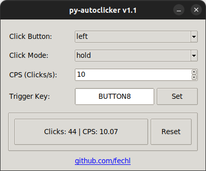

# Py-Autoclicker
**Py-Autoclicker** is a simple Python-based GUI application that simulates automatic mouse clicks with customizable modes and speed.



### Features
- Selectable click button: **Left** / **Right**
- Click modes:
  - **Hold**: Click while trigger is held
  - **Toggle**: Click repeatedly until toggled off
  - **Burst**: Click a fixed number of times in rapid succession
- Adjustable:
  - **CPS** (Clicks Per Second)
  - **Burst count**
  - **Burst delay** (in milliseconds)
- In-app CPS testing area
- Custom trigger key (keyboard or mouse)
- Configuration auto-saving

## Get Started
Clone the repository
```bash
git clone https://github.com/fechl/py-autoclicker.git
cd py-autoclicker
````
Install dependencies
```bash
pip install -r requirements.txt
```
Run the app
```bash
python main.py
```

## Version History

### v1.1
- Added **Burst Mode**: Click a set number of times quickly
- Improved **CPS testing area** with real-time feedback
- Trigger key can now be set using **mouse buttons** as well
- Configuration now **auto-saves** and reloads on change
- Minor UI enhancements and layout adjustments

### v1.0
- Initial release with:
  - Left/Right click support
  - Click modes: Hold & Toggle
  - Custom trigger key via keyboard
  - Basic CPS configuration and testing area
